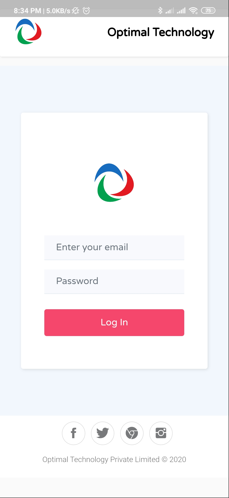
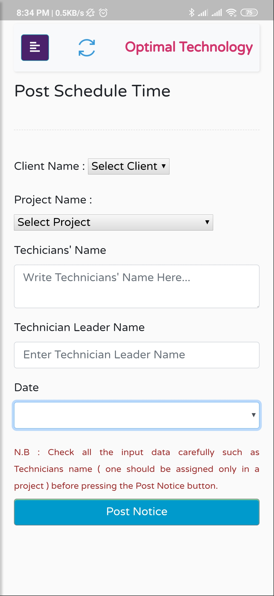
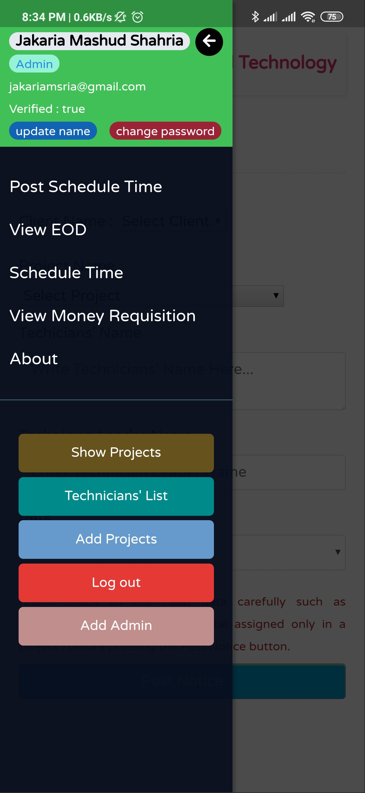

# Optimal Technology Ltd
## TikTalk
This Application is not a personal project. When I was an Intern of Optimal Technology Private Limited, they shared a sketch idea for making this Application for their office works. So I developed this as a single person. If I got a helping hand there, I would make it better.

## What was it for
### Admin Sides
- Post work schedule time for the **Technicians** by **Admins**.
- View EOD given by the Technicians.
- View Money Requisition given by the Technicians.
- Show Projects and Add Projects.
- List of all Technicians.
- Add another Admin( an Admin can add another admin ).

### Technician Sides
- View posted schedule time for work.
- give feedback for EOD.
- give Money Requisition feedback.
- Show Projects.

## Application Functionalities/Features
- Use HTML5, Bootstrap, JavaScript, JQuery, CSS etc.
- Hosting in Firebase.
- Use Firebase email authentication.( users are predefined ).
- Users can change their password.
- Users can update their name.
- If users forget their password, they can rest it by email.
- Users can verified their email.
- Use Firebase Function for defining Admin.
- Use Firebase Cloud Firestore for storing all the data.
- Use Firebase Storage for storing some images.

This Application is best for mobile devices and Tablets.
So for viewing I use Flutter Web View for it.
 The android Apk is here :  [OptimalTechnology.apk](https://drive.google.com/file/d/11MR03QLrf8qshDG1MrgT8uEgR2Fg7ldm/view?usp=sharing)

### Time to see some interfaces

- Splash Screen.

- Log in Screen.

- Main Menu.

- Sidebar for more Options.

This should be more reliable and should be used new technologies like React JS/Flutter/React Native.

